```mermaid
flowchart TB
    subgraph current["PromptSpark.Chat.csproj"]
        MAIN["<b>📦&nbsp;PromptSpark.Chat.csproj</b><br/><small>net9.0</small>"]
        click MAIN "#promptsparkchatpromptsparkchatcsproj"
    end

```

# Projects and dependencies analysis

This document provides a comprehensive overview of the projects and their dependencies in the context of upgrading to .NETCoreApp,Version=v10.0.

## Table of Contents

- [Executive Summary](#executive-Summary)
  - [Highlevel Metrics](#highlevel-metrics)
  - [Projects Compatibility](#projects-compatibility)
  - [Package Compatibility](#package-compatibility)
  - [API Compatibility](#api-compatibility)
- [Aggregate NuGet packages details](#aggregate-nuget-packages-details)
- [Top API Migration Challenges](#top-api-migration-challenges)
  - [Technologies and Features](#technologies-and-features)
  - [Most Frequent API Issues](#most-frequent-api-issues)
- [Projects Relationship Graph](#projects-relationship-graph)
- [Project Details](#project-details)

  - [PromptSpark.Chat\PromptSpark.Chat.csproj](#promptsparkchatpromptsparkchatcsproj)

## Executive Summary

### Highlevel Metrics

| Metric | Count | Status |
| :--- | :---: | :--- |
| Total Projects | 1 | All require upgrade |
| Total NuGet Packages | 7 | 3 need upgrade |
| Total Code Files | 48 |  |
| Total Code Files with Incidents | 4 |  |
| Total Lines of Code | 4155 |  |
| Total Number of Issues | 18 |  |
| Estimated LOC to modify | 13+ | at least 0.3% of codebase |

### Projects Compatibility

| Project | Target Framework | Difficulty | Package Issues | API Issues | Est. LOC Impact | Description |
| :--- | :---: | :---: | :---: | :---: | :---: | :--- |
| [PromptSpark.Chat\PromptSpark.Chat.csproj](#promptsparkchatpromptsparkchatcsproj) | net9.0 | 🟢 Low | 4 | 13 | 13+ | AspNetCore, Sdk Style = True |

### Package Compatibility

| Status | Count | Percentage |
| :--- | :---: | :---: |
| ✅ Compatible | 4 | 57.1% |
| ⚠️ Incompatible | 0 | 0.0% |
| 🔄 Upgrade Recommended | 3 | 42.9% |
| ***Total NuGet Packages*** | ***7*** | ***100%*** |

### API Compatibility

| Category | Count | Impact |
| :--- | :---: | :--- |
| 🔴 Binary Incompatible | 6 | High - Require code changes |
| 🟡 Source Incompatible | 0 | Medium - Needs re-compilation and potential conflicting API error fixing |
| 🔵 Behavioral change | 7 | Low - Behavioral changes that may require testing at runtime |
| ✅ Compatible | 6110 |  |
| ***Total APIs Analyzed*** | ***6123*** |  |

## Aggregate NuGet packages details

| Package | Current Version | Suggested Version | Projects | Description |
| :--- | :---: | :---: | :--- | :--- |
| Microsoft.AspNetCore.OpenApi | 9.0.4 | 10.0.1 | [PromptSpark.Chat.csproj](#promptsparkchatpromptsparkchatcsproj) | NuGet package upgrade is recommended |
| Microsoft.AspNetCore.SignalR | 1.2.0 |  | [PromptSpark.Chat.csproj](#promptsparkchatpromptsparkchatcsproj) | Needs to be replaced with Replace with new package Microsoft.AspNetCore.SignalR.Client=10.0.1 |
| Microsoft.Extensions.Options.ConfigurationExtensions | 9.0.4 | 10.0.1 | [PromptSpark.Chat.csproj](#promptsparkchatpromptsparkchatcsproj) | NuGet package upgrade is recommended |
| Microsoft.SemanticKernel | 1.47.0 |  | [PromptSpark.Chat.csproj](#promptsparkchatpromptsparkchatcsproj) | ✅Compatible |
| Scalar.AspNetCore | 2.2.1 |  | [PromptSpark.Chat.csproj](#promptsparkchatpromptsparkchatcsproj) | ✅Compatible |
| Serilog.AspNetCore | 9.0.0 |  | [PromptSpark.Chat.csproj](#promptsparkchatpromptsparkchatcsproj) | ✅Compatible |
| System.Text.Json | 9.0.4 | 10.0.1 | [PromptSpark.Chat.csproj](#promptsparkchatpromptsparkchatcsproj) | NuGet package upgrade is recommended |

## Top API Migration Challenges

### Technologies and Features

| Technology | Issues | Percentage | Migration Path |
| :--- | :---: | :---: | :--- |

### Most Frequent API Issues

| API | Count | Percentage | Category |
| :--- | :---: | :---: | :--- |
| M:Microsoft.Extensions.Configuration.ConfigurationBinder.GetValue''1(Microsoft.Extensions.Configuration.IConfiguration,System.String) | 5 | 38.5% | Binary Incompatible |
| T:System.Uri | 3 | 23.1% | Behavioral Change |
| T:System.Net.Http.HttpContent | 2 | 15.4% | Behavioral Change |
| M:Microsoft.Extensions.DependencyInjection.OptionsConfigurationServiceCollectionExtensions.Configure''1(Microsoft.Extensions.DependencyInjection.IServiceCollection,Microsoft.Extensions.Configuration.IConfiguration) | 1 | 7.7% | Binary Incompatible |
| M:System.Uri.#ctor(System.String) | 1 | 7.7% | Behavioral Change |
| M:Microsoft.Extensions.DependencyInjection.HttpClientFactoryServiceCollectionExtensions.AddHttpClient(Microsoft.Extensions.DependencyInjection.IServiceCollection,System.String,System.Action{System.Net.Http.HttpClient}) | 1 | 7.7% | Behavioral Change |

## Projects Relationship Graph

Legend:
📦 SDK-style project
⚙️ Classic project

```mermaid
flowchart LR
    P1["<b>📦&nbsp;PromptSpark.Chat.csproj</b><br/><small>net9.0</small>"]
    click P1 "#promptsparkchatpromptsparkchatcsproj"

```

## Project Details

### PromptSpark.Chat\PromptSpark.Chat.csproj

#### Project Info

- **Current Target Framework:** net9.0
- **Proposed Target Framework:** net10.0
- **SDK-style**: True
- **Project Kind:** AspNetCore
- **Dependencies**: 0
- **Dependants**: 0
- **Number of Files**: 459
- **Number of Files with Incidents**: 4
- **Lines of Code**: 4155
- **Estimated LOC to modify**: 13+ (at least 0.3% of the project)

#### Dependency Graph

Legend:
📦 SDK-style project
⚙️ Classic project

### API Compatibility

| Category | Count | Impact |
| :--- | :---: | :--- |
| 🔴 Binary Incompatible | 6 | High - Require code changes |
| 🟡 Source Incompatible | 0 | Medium - Needs re-compilation and potential conflicting API error fixing |
| 🔵 Behavioral change | 7 | Low - Behavioral changes that may require testing at runtime |
| ✅ Compatible | 6110 |  |
| ***Total APIs Analyzed*** | ***6123*** |  |

