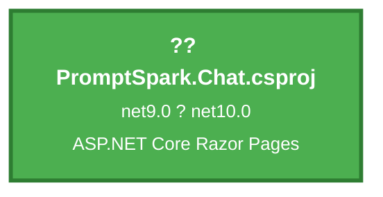

# .NET 10 Upgrade Plan - PromptSpark.Chat

## Table of Contents

- [Executive Summary](#executive-summary)
- [Migration Strategy](#migration-strategy)
- [Detailed Dependency Analysis](#detailed-dependency-analysis)
- [Project-by-Project Plans](#project-by-project-plans)
- [Package Update Reference](#package-update-reference)
- [Breaking Changes Catalog](#breaking-changes-catalog)
- [Testing & Validation Strategy](#testing--validation-strategy)
- [Complexity & Effort Assessment](#complexity--effort-assessment)
- [Source Control Strategy](#source-control-strategy)
- [Success Criteria](#success-criteria)

---

## Executive Summary

### Scenario Overview

This plan guides the upgrade of **PromptSpark.Chat** from **.NET 9.0** to **.NET 10.0 (LTS)**, a Long Term Support release with support until November 2028. This is a single-project ASP.NET Core Razor Pages application requiring framework retargeting, package updates, and API compatibility fixes.

### Scope

**Projects Affected**: 1 project
- PromptSpark.Chat.csproj (ASP.NET Core Razor Pages, SDK-style)

**Current State**:
- Target Framework: .NET 9.0 (STS)
- 7 NuGet packages total
- 4,155 lines of code across 48 code files
- 4 files with compatibility incidents

**Target State**:
- Target Framework: .NET 10.0 (LTS)
- 4 compatible packages (no change needed)
- 3 packages to upgrade
- 1 package to replace (Microsoft.AspNetCore.SignalR ? Microsoft.AspNetCore.SignalR.Client)

### Complexity Assessment

**Solution Complexity: Low** ??

**Key Metrics**:
- Single project with zero dependencies
- 4,155 LOC total
- Only 13+ lines estimated to require modification (0.3% of codebase)
- No security vulnerabilities detected
- 57% of packages already compatible
- Low difficulty rating per assessment

**Risk Profile**:
- **Binary Incompatible APIs**: 6 instances (high priority - require code changes)
- **Behavioral Change APIs**: 7 instances (medium priority - require testing)
- **Source Incompatible APIs**: 0 instances

**Most Frequent API Issues**:
1. `ConfigurationBinder.GetValue<T>` - 5 occurrences (38.5% of issues)
2. `System.Uri` constructor - behavioral changes (23.1%)
3. `System.Net.Http.HttpContent` - behavioral changes (15.4%)

### Selected Strategy

**All-At-Once Strategy** - All updates performed simultaneously in single atomic operation.

**Rationale**:
- Single project (no inter-project coordination needed)
- Low complexity and small codebase
- No dependency ordering concerns
- Minimal code changes required (0.3% of codebase)
- All packages have clear upgrade paths
- Fastest path to completion

**Strategy Characteristics**:
- Update project file and all package references simultaneously
- Fix all compilation errors in single pass
- Build and test as unified operation
- Single commit for entire upgrade

### Critical Issues

**No Security Vulnerabilities** ? - All packages are free of known security issues.

**Package Replacement Required** ??:
- `Microsoft.AspNetCore.SignalR` v1.2.0 must be replaced with `Microsoft.AspNetCore.SignalR.Client` v10.0.1
- This is an architectural change in how SignalR is packaged in modern .NET

**Binary Incompatible APIs** ??:
- Configuration binding APIs have changed signatures
- Requires code modifications before successful compilation

### Recommended Approach

**Timeline**: Single atomic upgrade phase followed by testing validation

**Iteration Strategy**: Fast batch (2-3 iterations)
- Foundation iteration: dependency analysis, migration strategy
- Detail iteration: complete project plan, package updates, breaking changes
- Final iteration: testing strategy, success criteria

**Expected Remaining Iterations**: 2-3 iterations to complete plan

---

## Migration Strategy

### Approach Selection

**Selected Strategy: All-At-Once Strategy**

All project files, package references, and code modifications are updated simultaneously in a single atomic operation. The solution moves from .NET 9.0 to .NET 10.0 in one coordinated upgrade with no intermediate states.

### Justification

**Why All-At-Once?**

1. **Single Project Solution** - Only one project to upgrade eliminates coordination complexity
2. **Low Code Impact** - Only 13+ lines (0.3% of codebase) need modification
3. **Clear Upgrade Path** - All packages have known target versions
4. **No Dependency Ordering** - Zero project dependencies means no migration sequencing required
5. **SDK-Style Project** - Modern project format simplifies framework retargeting
6. **Low Risk Profile** - No security vulnerabilities, 57% packages already compatible
7. **Efficiency** - Fastest path to completion for simple solutions

**Advantages for This Solution**:
- Minimal coordination overhead
- Single testing cycle
- Clean git history (one commit)
- Immediate availability of all .NET 10 features
- No multi-targeting complexity

**Strategy Characteristics**:
- **Simultaneity**: All changes applied together
- **Atomic Operation**: Update project file, packages, and code in single pass
- **No Intermediate States**: Direct migration from .NET 9 to .NET 10
- **Single Build/Test Cycle**: Verify entire solution after all changes complete

### Dependency-Based Ordering

**Not Applicable** - Single project means no dependency ordering constraints.

The upgrade sequence is driven by technical dependencies between operation types:
1. Framework retargeting (enables package updates)
2. Package updates (reveals API compatibility issues)
3. API compatibility fixes (enables successful build)
4. Build verification (confirms all changes successful)
5. Test execution (validates runtime behavior)

### Parallel vs Sequential Execution

**Sequential Execution Within Atomic Operation**

While the strategy is "all-at-once" at the project level, the individual operations within the atomic upgrade follow a logical sequence:

**Sequential Operations**:
1. Update TargetFramework property
2. Update/replace all PackageReference elements
3. Restore dependencies (`dotnet restore`)
4. Build solution to identify compilation errors
5. Fix all API compatibility issues
6. Rebuild to verify fixes
7. Execute tests to validate behavior

**Why Sequential?** Each operation depends on the previous one's completion:
- Package updates require framework retargeting first
- API issues only surface after building with new packages
- Testing requires successful build

### Phase Definitions

**Phase 0: Preparation** (if applicable)
- Verify .NET 10 SDK installed
- No global.json issues detected in assessment

**Phase 1: Atomic Upgrade**
- Update project file TargetFramework to net10.0
- Update all package references to .NET 10 compatible versions
- Replace Microsoft.AspNetCore.SignalR with Microsoft.AspNetCore.SignalR.Client
- Restore dependencies
- Build solution and fix all compilation errors
- Rebuild to verify 0 errors

**Phase 2: Test Validation**
- Execute all tests
- Validate Razor Pages functionality
- Confirm SignalR connectivity (after package replacement)
- Verify configuration binding (after API fixes)

### Risk Management Alignment

**All-At-Once Risks**:
- Larger initial change surface (mitigated by: low complexity, small codebase)
- All API issues surface simultaneously (mitigated by: only 6 binary incompatible APIs, clear patterns)
- Single point of validation (mitigated by: comprehensive test strategy)

**Risk Mitigation Built Into Strategy**:
- Dedicated upgrade branch (`upgrade-to-NET10`) isolates changes
- Assessment pre-identified all breaking changes
- Clear rollback path (revert single commit)
- Small codebase enables rapid iteration if issues found

---

## Detailed Dependency Analysis

### Dependency Graph Summary

PromptSpark.Chat is a **standalone single-project solution** with no project-to-project dependencies.



**Dependency Characteristics**:
- **Zero project dependencies** - No other projects in solution
- **Zero dependants** - Standalone application
- **SDK-style project** - Modern project format, simplified upgrade
- **ASP.NET Core Razor Pages** - Web application with Razor Pages UI

### Project Grouping

Since this is a single-project solution, there is only one migration phase:

**Phase 1: Atomic Upgrade**
- PromptSpark.Chat.csproj (all updates applied simultaneously)

### Critical Path

**Migration Order**: Not applicable - single project means no ordering constraints.

**Execution Approach**: All updates performed in single coordinated operation:
1. Update TargetFramework to net10.0
2. Update all package references
3. Replace Microsoft.AspNetCore.SignalR with Microsoft.AspNetCore.SignalR.Client
4. Fix API compatibility issues
5. Build and verify

### Circular Dependencies

**None** - Single project has no circular dependency risks.

### External Dependencies

**NuGet Package Dependencies** (7 total):
- **Compatible (no action)**: 4 packages
  - Microsoft.SemanticKernel 1.47.0
  - Scalar.AspNetCore 2.2.1
  - Serilog.AspNetCore 9.0.0
  - (One implicit framework package)

- **Upgrade Required**: 3 packages
  - Microsoft.AspNetCore.OpenApi: 9.0.4 ? 10.0.1
  - Microsoft.Extensions.Options.ConfigurationExtensions: 9.0.4 ? 10.0.1
  - System.Text.Json: 9.0.4 ? 10.0.1

- **Replacement Required**: 1 package
  - Microsoft.AspNetCore.SignalR 1.2.0 ? Microsoft.AspNetCore.SignalR.Client 10.0.1

---

## Project-by-Project Plans

### Project: PromptSpark.Chat.csproj

**Project Path**: `PromptSpark.Chat\PromptSpark.Chat.csproj`

**Current State**:
- Target Framework: net9.0
- Project Type: ASP.NET Core Razor Pages (SDK-style)
- Dependencies: 0 project references
- Dependants: 0 projects
- Package Count: 7 NuGet packages
- Lines of Code: 4,155
- Files with Incidents: 4 files
- Risk Level: ?? Low

**Target State**:
- Target Framework: net10.0
- Updated Packages: 3 packages upgraded, 1 package replaced
- Compatible Packages: 4 packages (no change)
- Expected Code Changes: 13+ lines (0.3% of codebase)

#### Migration Steps

**1. Prerequisites**

Verify .NET 10 SDK is installed on development machine.

**2. Update Target Framework**

Edit `PromptSpark.Chat\PromptSpark.Chat.csproj`:

Change:
```xml
<TargetFramework>net9.0</TargetFramework>
```

To:
```xml
<TargetFramework>net10.0</TargetFramework>
```

**3. Update Package References**

Update the following PackageReference elements in `PromptSpark.Chat\PromptSpark.Chat.csproj`:

| Package | Current Version | Target Version | Action |
|---------|----------------|----------------|--------|
| Microsoft.AspNetCore.OpenApi | 9.0.4 | 10.0.1 | Update version attribute |
| Microsoft.Extensions.Options.ConfigurationExtensions | 9.0.4 | 10.0.1 | Update version attribute |
| System.Text.Json | 9.0.4 | 10.0.1 | Update version attribute |
| Microsoft.AspNetCore.SignalR | 1.2.0 | N/A | **Remove** - obsolete package |

**Add new package** (replaces SignalR):
```xml
<PackageReference Include="Microsoft.AspNetCore.SignalR.Client" Version="10.0.1" />
```

**4. Expected Breaking Changes**

**A. Configuration Binding API Changes** (6 occurrences)

**Issue**: `ConfigurationBinder.GetValue<T>(IConfiguration, string)` signature changed - now requires explicit handling of missing keys.

**Affected Files**:
- `Program.cs` (lines 33, 73, 74)
- `Application\Diagnostics\ConfigurationDiagnostics.cs` (lines 21, 22)

**Current Pattern**:
```csharp
var value = configuration.GetValue<string>("KEY_NAME");
```

**Migration Pattern**:
```csharp
var value = configuration.GetValue<string>("KEY_NAME", defaultValue: null);
// or with explicit default
var value = configuration.GetValue<string>("KEY_NAME", defaultValue: "default-value");
```

**B. Options Configuration API Change** (1 occurrence)

**Issue**: `OptionsConfigurationServiceCollectionExtensions.Configure<T>` signature changed.

**Affected Files**:
- `Program.cs` (line 94)

**Current Pattern**:
```csharp
builder.Services.Configure<WorkflowOptions>(builder.Configuration.GetSection("Workflow"));
```

**Migration Pattern**: Add explicit null handling or validation:
```csharp
var workflowSection = builder.Configuration.GetSection("Workflow");
builder.Services.Configure<WorkflowOptions>(workflowSection);
```

**C. SignalR Package Replacement** (1 package change)

**Issue**: `Microsoft.AspNetCore.SignalR` v1.2.0 is obsolete for .NET 10. Must use `Microsoft.AspNetCore.SignalR.Client` instead.

**Action**:
1. Remove `Microsoft.AspNetCore.SignalR` PackageReference
2. Add `Microsoft.AspNetCore.SignalR.Client` version 10.0.1
3. Verify namespace imports (should be `Microsoft.AspNetCore.SignalR.Client`)
4. Test SignalR hub connections after upgrade

**D. System.Uri Behavioral Changes** (3 occurrences)

**Issue**: URI parsing and validation behavior changed in .NET 10 - stricter validation of malformed URIs.

**Affected Files**:
- `Program.cs` (lines 55, 66)

**Current Pattern**:
```csharp
var uri = new Uri(firstUrl);
client.BaseAddress = uriBuilder.Uri;
```

**Migration Considerations**:
- URI constructor now throws more aggressively on malformed input
- Existing try-catch block (line 55-62) should handle this
- Verify edge cases with invalid URL formats
- Consider explicit `UriKind` parameter if needed: `new Uri(firstUrl, UriKind.Absolute)`

**E. HttpContent Behavioral Changes** (2 occurrences)

**Issue**: `HttpContent.ReadAsStringAsync()` behavior changes around character encoding detection.

**Affected Files**:
- `Controllers\HomeController.cs` (lines 26, 40)

**Current Pattern**:
```csharp
var jsonContent = await response.Content.ReadAsStringAsync();
```

**Migration Considerations**:
- Encoding detection may behave differently
- UTF-8 is default, but edge cases with other encodings may change
- Test API calls that return non-UTF-8 content
- Consider explicit encoding: `response.Content.ReadAsStringAsync(Encoding.UTF8)`

**F. AddHttpClient Behavioral Change** (1 occurrence)

**Issue**: HttpClientFactory configuration behavior change.

**Affected Files**:
- `Program.cs` (line 31)

**Migration Considerations**:
- HttpClient lifetime management may have subtle changes
- BaseAddress assignment behavior remains compatible
- Test HTTP client resolution and request handling

**5. Code Modifications**

**Priority 1 - Binary Incompatible (Must Fix for Compilation)**:

1. **Program.cs, line 33**: Add default value parameter
   ```csharp
   var urls = builder.Configuration.GetValue<string>("ASPNETCORE_URLS", defaultValue: null);
   ```

2. **Program.cs, line 73**: Add default value parameter
   ```csharp
   string apikey = builder.Configuration.GetValue<string>("OPENAI_API_KEY", defaultValue: "not found");
   ```

3. **Program.cs, line 74**: Add default value parameter
   ```csharp
   string modelId = builder.Configuration.GetValue<string>("MODEL_ID", defaultValue: "gpt-4o");
   ```

4. **Program.cs, line 94**: Verify Configure call compiles
   ```csharp
   builder.Services.Configure<WorkflowOptions>(builder.Configuration.GetSection("Workflow"));
   ```

5. **ConfigurationDiagnostics.cs, line 21**: Add default value parameter
   ```csharp
   var apiKey = configuration.GetValue<string>("OPENAI_API_KEY", defaultValue: null);
   ```

6. **ConfigurationDiagnostics.cs, line 22**: Add default value parameter
   ```csharp
   var modelId = configuration.GetValue<string>("MODEL_ID", defaultValue: null);
   ```

**Priority 2 - Behavioral Changes (Test After Upgrade)**:

1. **HomeController.cs, lines 26, 40**: Test HTTP response handling
2. **Program.cs, lines 55, 66**: Test URI parsing with various URL formats
3. **Program.cs, line 31**: Test HttpClient instantiation and usage

**6. Testing Strategy**

**Unit Tests**:
- Test configuration binding with missing keys
- Test configuration binding with present keys
- Verify default values are applied correctly

**Integration Tests**:
- Test SignalR hub connections (after package replacement)
- Test HTTP client factory resolution
- Test API endpoint calls (HttpContent reading)

**Manual Testing**:
- Start application and verify it launches
- Test real-time features (SignalR hubs)
- Verify configuration values load from appsettings.json
- Test URI parsing with ASPNETCORE_URLS environment variable
- Verify HTTP client calls to workflow API

**Smoke Tests**:
- Application starts without errors
- Razor Pages render correctly
- SignalR connections establish
- Configuration diagnostics page shows correct values
- API calls succeed

**7. Validation Checklist**

- [ ] Project file TargetFramework is net10.0
- [ ] All 4 package references updated to version 10.0.1
- [ ] Microsoft.AspNetCore.SignalR removed
- [ ] Microsoft.AspNetCore.SignalR.Client added
- [ ] `dotnet restore` succeeds without errors
- [ ] Solution builds without errors
- [ ] Solution builds without warnings
- [ ] All 6 ConfigurationBinder.GetValue calls updated
- [ ] All unit tests pass
- [ ] Application starts successfully
- [ ] SignalR connections work
- [ ] Configuration values load correctly
- [ ] No runtime exceptions in logs

---

## Package Update Reference

### Package Updates Summary

| Status | Count | Action |
|--------|-------|--------|
| ? Compatible (no change) | 4 | Keep current version |
| ?? Upgrade Required | 3 | Update to version 10.0.1 |
| ?? Replacement Required | 1 | Replace with new package |
| **Total** | **7** | |

### Packages Requiring Updates

| Package | Current | Target | Projects | Reason |
|---------|---------|--------|----------|--------|
| Microsoft.AspNetCore.OpenApi | 9.0.4 | 10.0.1 | PromptSpark.Chat.csproj | .NET 10 framework compatibility |
| Microsoft.Extensions.Options.ConfigurationExtensions | 9.0.4 | 10.0.1 | PromptSpark.Chat.csproj | .NET 10 framework compatibility |
| System.Text.Json | 9.0.4 | 10.0.1 | PromptSpark.Chat.csproj | .NET 10 framework compatibility |

### Package Requiring Replacement

| Package (Remove) | Current | Package (Add) | Target | Reason |
|------------------|---------|---------------|--------|--------|
| Microsoft.AspNetCore.SignalR | 1.2.0 | Microsoft.AspNetCore.SignalR.Client | 10.0.1 | Architectural change in SignalR packaging for modern .NET |

**Migration Note**: `Microsoft.AspNetCore.SignalR` v1.2.0 is an obsolete package from the .NET Core 2.x era. In modern .NET (5+), SignalR client functionality is provided by `Microsoft.AspNetCore.SignalR.Client`. The server-side functionality is included in the ASP.NET Core framework itself.

### Compatible Packages (No Change Required)

| Package | Current Version | Status |
|---------|----------------|--------|
| Microsoft.SemanticKernel | 1.47.0 | ? Compatible with .NET 10 |
| Scalar.AspNetCore | 2.2.1 | ? Compatible with .NET 10 |
| Serilog.AspNetCore | 9.0.0 | ? Compatible with .NET 10 |
| *(Implicit framework packages)* | - | ? Compatible with .NET 10 |

### Update Instructions

**Step 1: Edit PromptSpark.Chat\PromptSpark.Chat.csproj**

Locate the PackageReference elements and update as follows:

**Update these package versions**:
```xml
<PackageReference Include="Microsoft.AspNetCore.OpenApi" Version="10.0.1" />
<PackageReference Include="Microsoft.Extensions.Options.ConfigurationExtensions" Version="10.0.1" />
<PackageReference Include="System.Text.Json" Version="10.0.1" />
```

**Remove this package**:
```xml
<!-- REMOVE THIS LINE -->
<PackageReference Include="Microsoft.AspNetCore.SignalR" Version="1.2.0" />
```

**Add this package**:
```xml
<!-- ADD THIS LINE -->
<PackageReference Include="Microsoft.AspNetCore.SignalR.Client" Version="10.0.1" />
```

**Step 2: Restore Packages**

After editing the project file:
```bash
dotnet restore PromptSpark.Chat\PromptSpark.Chat.csproj
```

**Step 3: Verify No Package Conflicts**

Check for dependency conflicts:
```bash
dotnet list PromptSpark.Chat\PromptSpark.Chat.csproj package
```

### Package-Specific Migration Notes

**Microsoft.AspNetCore.OpenApi (9.0.4 ? 10.0.1)**
- OpenAPI specification generation for ASP.NET Core
- No breaking API changes expected
- Supports .NET 10 improved performance and features

**Microsoft.Extensions.Options.ConfigurationExtensions (9.0.4 ? 10.0.1)**
- Configuration binding and options pattern
- **Breaking Change**: Configuration binding APIs require explicit default value handling
- See Breaking Changes Catalog for code modifications

**System.Text.Json (9.0.4 ? 10.0.1)**
- JSON serialization/deserialization
- Improved performance in .NET 10
- New features: improved polymorphic serialization, better trimming support

**Microsoft.AspNetCore.SignalR.Client (new in this upgrade)**
- Real-time communication client library
- Replaces obsolete Microsoft.AspNetCore.SignalR v1.2.0
- Namespace: `Microsoft.AspNetCore.SignalR.Client`
- **Post-update verification required**: Test all SignalR hub connections

---

## Breaking Changes Catalog

### Overview

Total breaking changes: **13 API issues** across 4 files

| Category | Count | Severity | Action Required |
|----------|-------|----------|-----------------|
| ?? Binary Incompatible | 6 | High | Code changes mandatory for compilation |
| ?? Behavioral Change | 7 | Medium | Testing required for runtime validation |

### Binary Incompatible Changes (Must Fix)

#### 1. ConfigurationBinder.GetValue<T> Signature Change

**API**: `Microsoft.Extensions.Configuration.ConfigurationBinder.GetValue<T>(IConfiguration, string)`

**Change**: Method signature now requires explicit default value parameter.

**Occurrences**: 5 instances

**Affected Files**:
- `Program.cs` - 3 occurrences (lines 33, 73, 74)
- `Application\Diagnostics\ConfigurationDiagnostics.cs` - 2 occurrences (lines 21, 22)

**Migration Pattern**:

? **Old (will not compile)**:
```csharp
var value = configuration.GetValue<string>("KEY_NAME");
```

? **New (required)**:
```csharp
var value = configuration.GetValue<string>("KEY_NAME", defaultValue: null);
// or with explicit default
var value = configuration.GetValue<string>("KEY_NAME", defaultValue: "default-value");
```

**Specific Fixes Required**:

**Program.cs, line 33**:
```csharp
// Before
var urls = builder.Configuration.GetValue<string>("ASPNETCORE_URLS");

// After
var urls = builder.Configuration.GetValue<string>("ASPNETCORE_URLS", defaultValue: null);
```

**Program.cs, line 73**:
```csharp
// Before
string apikey = builder.Configuration.GetValue<string>("OPENAI_API_KEY") ?? "not found";

// After
string apikey = builder.Configuration.GetValue<string>("OPENAI_API_KEY", defaultValue: null) ?? "not found";
```

**Program.cs, line 74**:
```csharp
// Before
string modelId = builder.Configuration.GetValue<string>("MODEL_ID") ?? "gpt-4o";

// After
string modelId = builder.Configuration.GetValue<string>("MODEL_ID", defaultValue: null) ?? "gpt-4o";
```

**ConfigurationDiagnostics.cs, line 21**:
```csharp
// Before
var apiKey = configuration.GetValue<string>("OPENAI_API_KEY");

// After
var apiKey = configuration.GetValue<string>("OPENAI_API_KEY", defaultValue: null);
```

**ConfigurationDiagnostics.cs, line 22**:
```csharp
// Before
var modelId = configuration.GetValue<string>("MODEL_ID");

// After
var modelId = configuration.GetValue<string>("MODEL_ID", defaultValue: null);
```

**Rationale**: .NET 10 requires explicit handling of missing configuration keys to improve null-safety and prevent runtime exceptions.

**Documentation**: [Breaking changes in .NET](https://go.microsoft.com/fwlink/?linkid=2262679)

---

#### 2. OptionsConfigurationServiceCollectionExtensions.Configure<T> Change

**API**: `Microsoft.Extensions.DependencyInjection.OptionsConfigurationServiceCollectionExtensions.Configure<T>(IServiceCollection, IConfiguration)`

**Change**: Stricter validation and binding behavior.

**Occurrences**: 1 instance

**Affected Files**:
- `Program.cs` (line 94)

**Current Code**:
```csharp
builder.Services.Configure<WorkflowOptions>(builder.Configuration.GetSection("Workflow"));
```

**Migration Pattern**:

This code should continue to compile, but may exhibit stricter validation:

? **Recommended approach** (defensive):
```csharp
var workflowSection = builder.Configuration.GetSection("Workflow");
if (workflowSection.Exists())
{
    builder.Services.Configure<WorkflowOptions>(workflowSection);
}
else
{
    // Optionally configure defaults or log warning
    builder.Services.Configure<WorkflowOptions>(options => { /* defaults */ });
}
```

**Rationale**: .NET 10 has stricter validation of configuration section binding.

**Documentation**: [Breaking changes in .NET](https://go.microsoft.com/fwlink/?linkid=2262679)

---

### Behavioral Changes (Requires Testing)

#### 3. System.Uri Constructor and Property Behavior

**API**: 
- `System.Uri(string)` constructor
- `System.Uri` type usage

**Change**: Stricter URI validation and parsing behavior.

**Occurrences**: 3 instances

**Affected Files**:
- `Program.cs` (lines 55, 66)

**Current Code** (line 55):
```csharp
var uri = new Uri(firstUrl);
```

**Behavioral Change**:
- More aggressive exception throwing on malformed URIs
- Stricter validation of URI components (scheme, host, port)
- Edge cases with relative URIs may behave differently

**Migration Considerations**:

The existing try-catch block should handle exceptions:
```csharp
try
{
    var firstUrl = urls.Split(';').FirstOrDefault();
    if (!string.IsNullOrEmpty(firstUrl))
    {
        var uri = new Uri(firstUrl); // May throw more frequently in .NET 10
        uriBuilder.Host = uri.Host;
        uriBuilder.Port = uri.Port;
    }
}
catch (UriFormatException ex)
{
    Log.Error(ex, "Error parsing ASPNETCORE_URLS");
}
```

**Recommended Enhancement** (optional):
```csharp
// More defensive approach
if (!string.IsNullOrEmpty(firstUrl) && Uri.TryCreate(firstUrl, UriKind.Absolute, out var uri))
{
    uriBuilder.Host = uri.Host;
    uriBuilder.Port = uri.Port;
}

````````
